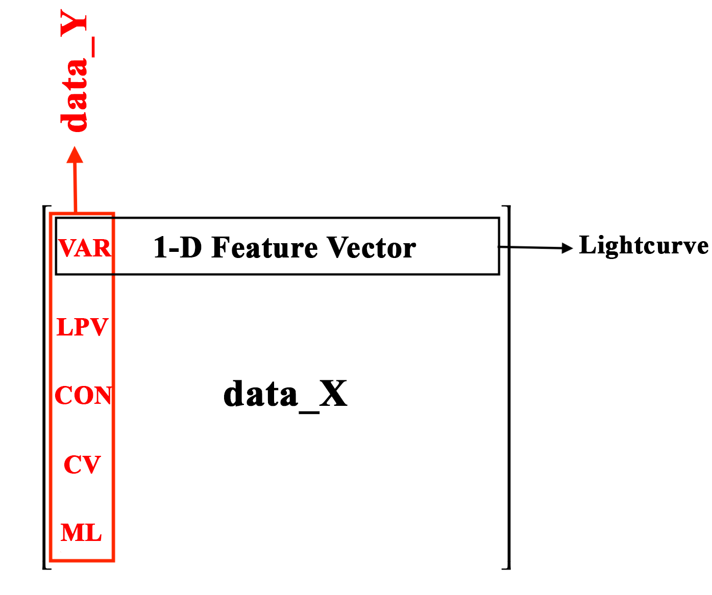

.. _Data_Preprocessing:

Data Preprocessing
==================

In most machine tutorials you will run into two common variables: data_X and data_Y.

data_X corresponds to the 2-dimensional features matrix, with each row being the one-dimensional feature vector for that particular sample -- data_Y is then the corresponding label. In this tutorial we will be working with 150 lightcurves, 30 lightcurves per class: Variable (VAR), Long Period Variable (LPV), Constant (CON), Cataclysmic Variable (CV), and Microlensing (ML). These five classes have been simulated, 30 times each, therefore our training set contains 5 classes, with each containing 30 samples. 

The lightcurves for these 150 simulated lightcurves can be :download:`downloaded here <lightcurves.zip>`.

We will load these lightcurves to construct our feature matrix, which will look like this:

|

